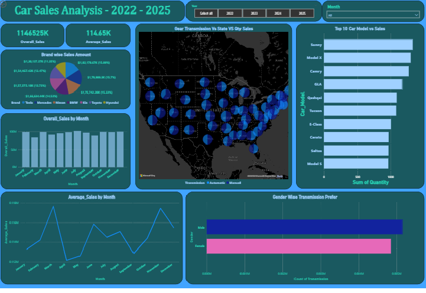

# Raw-Car-Sales-Data-Analysis-2022-2025-_-Power-BI
Power BI project analyzing Raw Car Sales Data Analysis (US) 2022-2025 _ Power BI

# 🚗 Car Sales Analysis (2022–2025)

## 📌 Project Overview
This project analyzes car sales data in the US from **2022 to 2025**.  
The dataset consists of **three CSV tables** with ~10,000 rows and 22 columns, obtained from the original raw car sales dataset.

---

## 🛠 Data Pre-processing (Excel)
1. Removed duplicates in **Sales ID**.  
2. Standardized **Customer Names** to proper case.  
3. Concatenated first/last names into a single **Full Name** column and trimmed non-printable characters.  
4. Created an **Adult Category** column using nested `IF` based on age.  
5. Used **VLOOKUP** to transfer necessary data across tables.  
6. Replaced superfluous symbols using **Replace Values**.

---

## 📊 Visualization (Power BI)
- **Line Chart + Matrix Table** → Overall sales performance (2022–2025) with YoY growth ratios.  
- **Line + Stacked Column Chart** → Total sales per state vs. average.  
- **Matrix Table with Conditional Formatting** → Car model sales by year.  
- **Clustered Column Chart** → Adult vs. Senior preferences by car model.  
- **Funnel Chart** → Sales by automobile segment (cars divided into 4 categories by pricing).  
- **Dynamic Dashboard** → Interactive slicers for year/month, showing:
  - Overall & average sales  
  - Sales by brand  
  - Sales by month  
  - Transmission preferences by gender  
  - Top 10 car sales  
  - Map chart: gear transmission sales by state  

---

## 📈 Summary & Insights
- Hyper-growth in **2023**, momentum sustained in **2024**.  
- YoY growth percentages skewed due to sharp jump from 2022 → 2023.  
- **Mississippi** = highest overall sales; **West Virginia** = lowest.  
- Adults consistently outnumber Seniors in purchases.  
- **Toyota & Hyundai** → stronger Senior engagement.  
- **Tesla, BMW, Nissan** → more Adult-driven.  
- Premium cars dominate; **Economy cars underperform**.  
- Luxury & Compact segments show balanced demand.  

---

## 🔝 Highest-Selling Models
- **Camry**: 73.6M  
- **Sunny**: 73.4M  
- **Sportage**: 71.8M  
- **Model X**: 64.8M  
- **GLA**: 64.6M  

## 📉 Lowest-Selling Models
- **Seltos**: 32.3M  
- **Qashqai & Corolla**: 45M each  

---

## 🎯 Strategic Observations
- SUVs dominate (Sportage, Sunny, GLA, Model X).  
- Sedans (Camry, C-Class) still strong.  
- Sales dip in **2025** may indicate market saturation or shifting preferences.  

---

## 📸 Dashboard Preview

